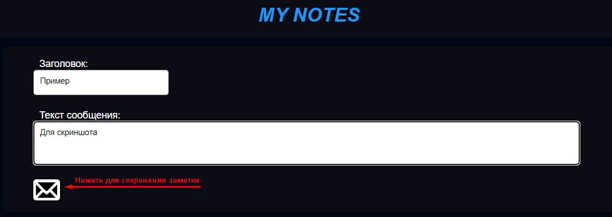
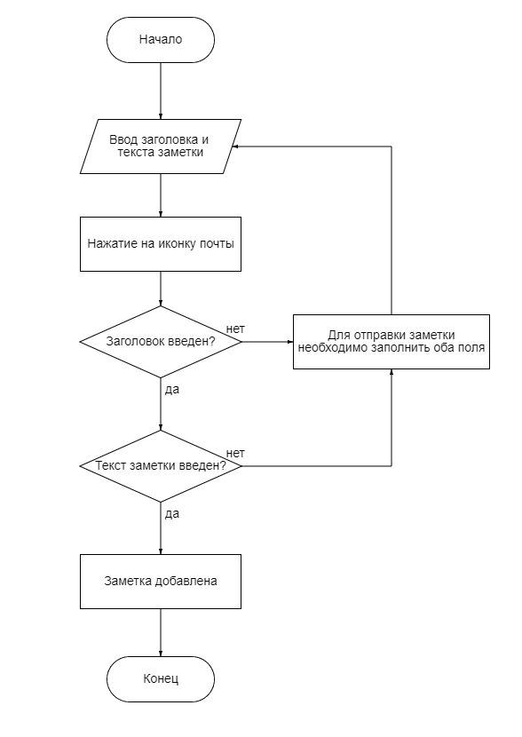
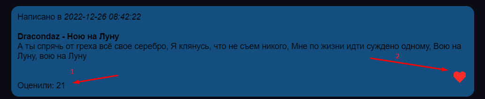
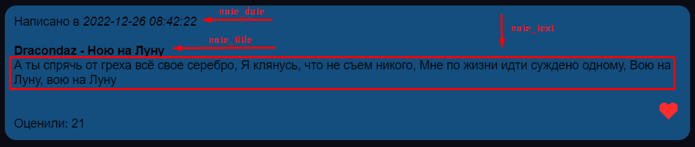

# Лабораторная работа 2

## Задание

Разработать и реализовать клиент-серверную информационную систему, реализующую механизм CRUD.

## Ход работы

- ### Разработаем пользовательский интерфейс и опишем пользовательские сценарии работы

Первоначально пользователь попадает на главную страницу сайта - `index.php`, на которой находится шапка, на которой написано "My Notes", а ниже поле для заголовка и теста сообщения.

На сайте отображаются последние 100 заметок.

- ### Создание новой заметки

Для того, чтобы оставить какое-либо сообщение, необходимо заполнить заголовок и текст сообщения, после чего нажать на иконку письма, как показано на рисунке ниже. На рис.2 показана блок-схема, демонстрирующая добавление новой заметки

- ### Лайк заметки

Для того, чтобы поставить "лайк" какой-то заметке, необходимо нажать на красное сердечко (2), находящееся рядом с заметкой, и Ваш лайк появится в количестве лайков под записью (1).

- ### Структура заметки

В самом верху заметки пишется дата (`note_date`), затем заголовок (`note_title`), сам текст сообщения (`note_text`), чуть ниже - количество лайков, оставленных этой записи (`note_likes`) и правее - кнопка "Мне нравится".

## База данных

Для хранения данных о заметках, в частности, заголовка, текста, даты и количества лайков, нам необходимо место, в которое мы сможем заносить информацию. И здесь нам на помощь придёт база данных (далее - БД).

Ниже представлена структура БД моего сайта:

| Имя        | Тип данных | Значение по умолчанию | Дополнительно  |                         Описание |
| ---------- | :--------: | :-------------------: | :------------: | -------------------------------: |
| note_id    |    int     |           -           | AUTO_INCREMENT | Уникальный идентификатор заметки |
| note_title |    text    |           -           |       -        |                Заголовок заметки |
| note_text  |    text    |           -           |       -        |                    Текст заметки |
| note_date  |  datetime  |           -           |       -        |                     Дата заметки |
| note_likes |    int     |           0           |       -        |                Количество лайков |

## Хореография

1. Отправка сообщения - Принимается введенное сообщение. Отправляется запрос на добавление сообщения в базу данных. Затем происходит обновление страницы.
2. Кнопка like вызывает отправление запроса в базу данных на изменение количества лайков на определенном id сообщения.
